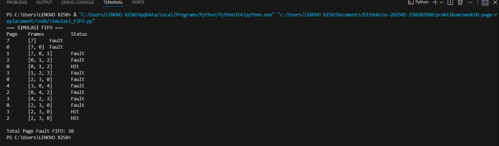
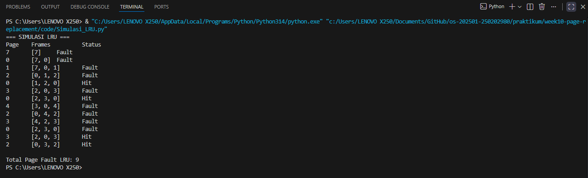
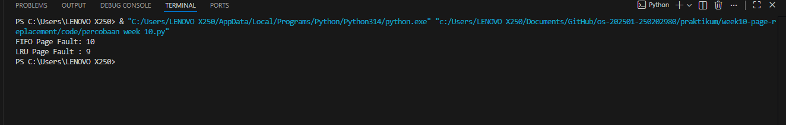

# Laporan Praktikum Minggu 10
Topik:  Docker – Resource Limit (CPU & Memori)

---

## Identitas
- **Nama**  : Muslimah Nuraini
- **NIM**   : 250202980  
- **Kelas** : 1IKRB

---

## Tujuan
1. Mengimplementasikan algoritma page replacement FIFO dalam program.
2. Mengimplementasikan algoritma page replacement LRU dalam program.
3. .Menjalankan simulasi page replacement dengan dataset tertentu.
4. Membandingkan performa FIFO dan LRU berdasarkan jumlah page fault.
5. Menyajikan hasil simulasi dalam laporan yang sistematis.

---

## Dasar Teori
1. Manajemen memori dalam sistem operasi bertujuan mengatur penggunaan memori utama secara efisien agar proses dapat berjalan optimal tanpa kehabisan ruang memori.
2. Page replacement algorithm digunakan ketika terjadi page fault, yaitu kondisi saat halaman yang dibutuhkan tidak tersedia di memori sehingga sistem harus mengganti halaman lain.
3. Algoritma FIFO (First In First Out) mengganti halaman yang pertama kali masuk ke memori tanpa memperhatikan apakah halaman tersebut masih sering digunakan.
4. Algoritma LRU (Least Recently Used) mengganti halaman yang paling lama tidak digunakan dengan asumsi bahwa halaman yang baru saja digunakan akan digunakan kembali.
5. Jumlah page fault menjadi indikator efisiensi algoritma; semakin sedikit page fault, semakin baik kinerja pengelolaan memori sistem.

---

## Langkah Praktikum
1. **Menyiapkan Dataset**

   Gunakan *reference string* berikut sebagai contoh:
   ```
   7, 0, 1, 2, 0, 3, 0, 4, 2, 3, 0, 3, 2
   ```
   Jumlah frame memori: **3 frame**.

2. **Implementasi FIFO**

   - Simulasikan penggantian halaman menggunakan algoritma FIFO.
   - Catat setiap *page hit* dan *page fault*.
   - Hitung total *page fault*.

3. **Implementasi LRU**

   - Simulasikan penggantian halaman menggunakan algoritma LRU.
   - Catat setiap *page hit* dan *page fault*.
   - Hitung total *page fault*.

4. **Eksekusi & Validasi**

   - Jalankan program untuk FIFO dan LRU.
   - Pastikan hasil simulasi logis dan konsisten.
   - Simpan screenshot hasil eksekusi.

5. **Analisis Perbandingan**

   Buat tabel perbandingan seperti berikut:

   | Algoritma | Jumlah Page Fault | Keterangan |
   |:--|:--:|:--|
   | FIFO | ... | ... |
   | LRU | ... | ... |


   - Jelaskan mengapa jumlah *page fault* bisa berbeda.
   - Analisis algoritma mana yang lebih efisien dan alasannya.

6. **Commit & Push**

   ```bash
   git add .
   git commit -m "Minggu 10 - Page Replacement FIFO & LRU"
   git push origin main
   ```
---

## Kode / Perintah
```
praktikum/week10-page-replacement/
├─ code/
│  ├─ page_replacement.*
│  └─ reference_string.txt
├─ screenshots/
│  └─ hasil_simulasi.png
└─ laporan.md
```

---

## Hasil Eksekusi
Sertakan screenshot hasil percobaan atau diagram:
Hail Simulasi FIFO

Hasil Simulasi LRU

Hasil Simulasi Perbandingan


---

## Analisis
- Tabel Perbandingan
| Algoritma | Jumlah Page Fault | Keterangan |
   |:--|:--:|:--|
   | FIFO | 10 | Mengganti halaman berdasarkan urutan pertama kali masuk ke memori tanpa mempertimbangkan frekuensi maupun waktu terakhir halaman digunakan. Akibatnya, halaman yang masih sering dibutuhkan bisa saja diganti, sehingga pada pola akses tertentu jumlah page fault menjadi lebih tinggi. |
   | LRU | 9 | Mengganti halaman yang paling lama tidak digunakan dengan mempertimbangkan riwayat akses halaman. Pendekatan ini membuat halaman yang sering digunakan tetap berada di memori lebih lama, sehingga dapat mengurangi jumlah page fault dibandingkan FIFO. |

- Jelaskan mengapa jumlah *page fault* bisa berbeda.
   Jumlah *page fault* bisa berbeda karena dilihat dari cara algoritma menentukan halaman yang akan diganti,FIFO mengganti halaman berdasarkan urutan masuk tanpa melihat apakah halaman tersebut masih sering digunakan, sedangkan LRU mempertimbangkan waktu penggunaan terakhir halaman.

- Analisis algoritma mana yang lebih efisien dan alasannya.
   Algoritma LRU lebih efisien karena mampu mempertahankan halaman yang sering digunakan di memori sehingga menghasilkan page fault lebih sedikit dibandingkan FIFO.


---

## Kesimpulan
1. Algoritma FIFO dan LRU memiliki cara kerja berbeda dalam mengganti halaman sehingga menghasilkan jumlah page fault yang berbeda.
2. Berdasarkan hasil simulasi, algoritma LRU lebih efisien karena menghasilkan page fault lebih sedikit dibandingkan FIFO.
3. Pemilihan algoritma page replacement berpengaruh terhadap kinerja manajemen memori sistem.
---

## Quiz
1. Apa perbedaan utama FIFO dan LRU?
   FIFO mengganti halaman berdasarkan urutan pertama masuk ke memori, sedangkan LRU mengganti halaman yang paling lama tidak digunakan berdasarkan riwayat akses.
2. Mengapa FIFO dapat menghasilkan *Belady’s Anomaly*?
   Karena FIFO tidak mempertimbangkan pola penggunaan halaman, penambahan jumlah frame justru dapat menyebabkan lebih banyak page fault.
3. Mengapa LRU umumnya menghasilkan performa lebih baik dibanding FIFO?
   Karena LRU mempertahankan halaman yang sering atau baru digunakan, sehingga lebih sesuai dengan pola akses program dan menghasilkan page fault yang lebih sedikit.

---

## Refleksi Diri
Tuliskan secara singkat:
- Apa bagian yang paling menantang minggu ini?  
  Bagian yang paling menantang bagi saya yaitu memahami dan mensimulasikan cara kerja algoritma page replacement (FIFO dan LRU), terutama dalam melacak page hit, page fault, dan perubahan isi frame di setiap langkah.
- Bagaimana cara Anda mengatasinya?  
  Cara saya mengatasinya adalah dengan mempelajari konsep dasar algoritma secara bertahap.

---

**Credit:**  
_Template laporan praktikum Sistem Operasi (SO-202501) – Universitas Putra Bangsa_
