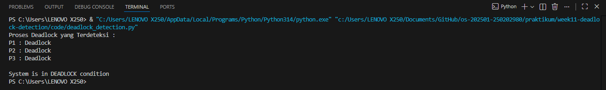

# Laporan Praktikum Minggu 11
Topik: Simulasi dan Deteksi Deadlock

---

## Identitas
- **Nama**  : Muslimah Nuraini
- **NIM**   : 250202980
- **Kelas** : 1IKRB

---

## Tujuan
1. Membuat program sederhana untuk mendeteksi deadlock.  
2. Menjalankan simulasi deteksi deadlock dengan dataset uji.  
3. Menyajikan hasil analisis deadlock dalam bentuk tabel.  
4. Memberikan interpretasi hasil uji secara logis dan sistematis.
5. Menyusun laporan praktikum sesuai format yang ditentukan.

---

## Dasar Teori
1. Deadlock adalah kondisi ketika dua atau lebih proses saling menunggu resource yang sedang dipegang proses lain sehingga tidak ada proses yang dapat melanjutkan eksekusi.
2. Deadlock hanya dapat terjadi jika empat kondisi terpenuhi secara bersamaan, yaitu mutual exclusion, hold and wait, no preemption, dan circular wait.
3. Deteksi deadlock dilakukan dengan menganalisis hubungan tunggu antar proses berdasarkan data allocation dan request resource.
4. Pada sistem dengan single-instance resource, deadlock dapat dideteksi menggunakan Wait-For Graph, di mana keberadaan siklus menandakan deadlock.
5. Proses yang berada dalam siklus tunggu dinyatakan sebagai proses deadlock dan menyebabkan sistem berada dalam kondisi tidak aman.

---

## Langkah Praktikum
1. **Menyiapkan Dataset**

   Gunakan dataset sederhana yang berisi:
   - Daftar proses  
   - Resource Allocation  
   - Resource Request / Need

   Contoh tabel:

   | Proses | Allocation | Request |
   |:--:|:--:|:--:|
   | P1 | R1 | R2 |
   | P2 | R2 | R3 |
   | P3 | R3 | R1 |

2. **Implementasi Algoritma Deteksi Deadlock**

   Program minimal harus:
   - Membaca data proses dan resource.  
   - Menentukan apakah sistem berada dalam kondisi deadlock.  
   - Menampilkan proses mana saja yang terlibat deadlock.

3. **Eksekusi & Validasi**

   - Jalankan program dengan dataset uji.  
   - Validasi hasil deteksi dengan analisis manual/logis.  
   - Simpan hasil eksekusi dalam bentuk screenshot.

4. **Analisis Hasil**

   - Sajikan hasil deteksi dalam tabel (proses deadlock / tidak).  
   - Jelaskan mengapa deadlock terjadi atau tidak terjadi.  
   - Kaitkan hasil dengan teori deadlock (empat kondisi).

5. **Commit & Push**

   ```bash
   git add .
   git commit -m "Minggu 11 - Deadlock Detection"
   git push origin main
   ```

---

## Kode / Perintah
```
praktikum/week11-deadlock-detection/
├─ code/
│  ├─ deadlock_detection.*
│  └─ dataset_deadlock.csv
├─ screenshots/
│  └─ hasil_deteksi.png
└─ laporan.md
```

---

## Hasil Eksekusi
Hasil Deteksi

 
---

## Analisis
- Tabel Hasil Deteksi Tabel
   | Proses | Status |
   |:--:|:--:
   | P1 | Deadlock |
   | P2 | Deadlock |
   | P3 | Deadlock |


- Penjelasan Hasil

  Dari hasil eksekusi program, terlihat bahwa semua proses mengalami deadlock. Setiap proses memegang satu resource, namun pada saat yang bersamaan juga sambil menunggu resource lain yang sedang digunakan oleh proses berbeda. Karena tidak ada resource yang tersedia, tidak satu pun proses dapat melanjutkan eksekusinya, sehingga sistem terhenti pada kondisi deadlock.
 
- Kaitkan Hasil dengan Teori Deadlock (empat kondisi)

  Hasil deteksi menunjukkan bahwa kondisi deadlock terjadi karena sistem memenuhi keempat syarat deadlock. Resource hanya dapat digunakan oleh satu proses dalam satu waktu, setiap proses menahan resource yang dimilikinya sambil menunggu resource lain, resource tidak dapat diambil secara paksa oleh sistem, dan terdapat siklus saling menunggu antar proses. Pemenuhan keempat kondisi tersebut menyebabkan sistem berada dalam keadaan deadlock.

---

## Kesimpulan
1. Praktikum ini menunjukkan bahwa deadlock dapat dideteksi dengan menganalisis hubungan antara proses dan resource berdasarkan data alokasi dan permintaan resource.
2. Hasil percobaan membuktikan bahwa deadlock terjadi ketika keempat kondisi deadlock terpenuhi, khususnya adanya circular wait antar proses.
3. Deteksi deadlock membantu mengetahui proses mana saja yang terlibat deadlock sehingga dapat digunakan sebagai dasar pengambilan tindakan untuk menangani kondisi tersebut.

---

## Quiz
1. Apa perbedaan antara deadlock prevention, avoidance, dan detection?

   Deadlock prevention mencegah deadlock sejak awal dengan membatasi cara proses memakai resource. Deadlock avoidance menghindari deadlock dengan mengecek kondisi sistem sebelum resource diberikan. Deadlock detection membiarkan sistem berjalan normal lalu mendeteksi deadlock jika sudah terjadi.

2. Mengapa deteksi deadlock tetap diperlukan dalam sistem operasi?

    Deteksi deadlock tetap diperlukan karena mencegah atau menghindari deadlock sering membuat sistem jadi kurang efisien. Dengan deteksi, resource bisa digunakan secara maksimal dan masalah ditangani saat benar-benar terjadi.

3. Apa kelebihan dan kekurangan pendekatan deteksi deadlock?

    Kelebihan deteksi deadlock adalah penggunaan resource lebih fleksibel dan efisien, sedangkan kekurangannya adalah deadlock baru diketahui setelah terjadi dan perlu penanganan tambahan untuk memulihkannya.

---

## Refleksi Diri
Tuliskan secara singkat:
- Apa bagian yang paling menantang minggu ini?  

   Memahami konsep deadlock
- Bagaimana cara Anda mengatasinya?  

   Mempelajari kembali teori deadlock secara bertahap

---

**Credit:**  
_Template laporan praktikum Sistem Operasi (SO-202501) – Universitas Putra Bangsa_
