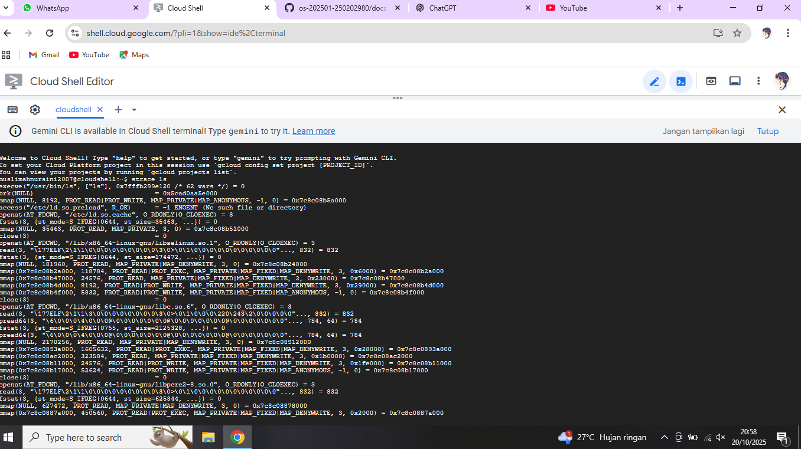
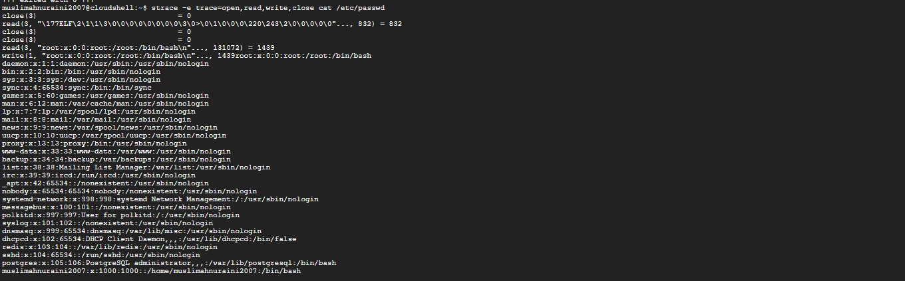
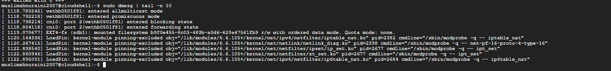
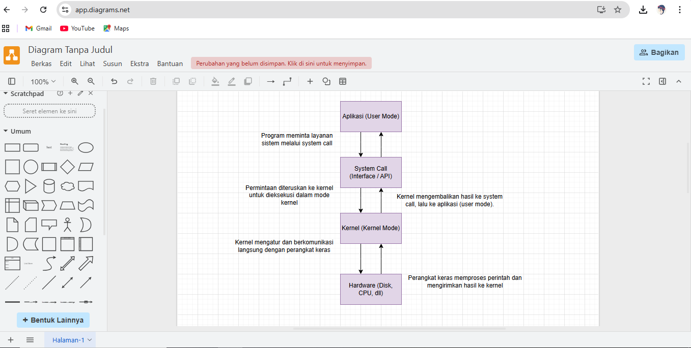

# Laporan Praktikum Minggu [2]
Topik: Struktur System Call dan Fungsi Kernel


---

## Identitas
- **Nama**  : [Muslimah Nuraini]  
- **NIM**   : [250202980]  
- **Kelas** : [1IKRB]

---

## Tujuan
Tuliskan tujuan praktikum minggu ini.  
 
 1. Menjelaskan konsep dan fungsi system call dalam sistem operasi.
 2. Mengidentifikasi jenis-jenis system call dan fungsinya.
 3. Mengamati alur perpindahan mode user ke kernel saat system call terjadi.
 4. Menggunakan perintah Linux untuk menampilkan dan menganalisis system call.


---

## Dasar Teori
1. System call, sebagai jembatan antara program user dengan kernel agar bisa mengakses layanan sistem seperti membuka, membaca, atau menulis file.
2. Perintah strace, digunakan untuk melihat system call yang dijalankan oleh program, misalnya open, read, write, dan close.
3. Perintah dmesg, menampilkan pesan dari kernel, seperti proses pemuatan modul atau aktivitas perangkat keras.
---

## Langkah Praktikum
1. 1. **Setup Environment**
   - Gunakan Linux (Ubuntu/WSL).
   - Pastikan perintah `strace` dan `man` sudah terinstal.
   - Konfigurasikan Git (jika belum dilakukan di minggu sebelumnya).

2. **Eksperimen 1 – Analisis System Call**
   Jalankan perintah berikut:
   ```bash
   strace ls
   ```
   > Catat 5–10 system call pertama yang muncul dan jelaskan fungsinya.  
   Simpan hasil analisis ke `results/syscall_ls.txt`.

3. **Eksperimen 2 – Menelusuri System Call File I/O**
   Jalankan:
   ```bash
   strace -e trace=open,read,write,close cat /etc/passwd
   ```
   > Analisis bagaimana file dibuka, dibaca, dan ditutup oleh kernel.

4. **Eksperimen 3 – Mode User vs Kernel**
   Jalankan:
   ```bash
   dmesg | tail -n 10
   ```
   > Amati log kernel yang muncul. Apa bedanya output ini dengan output dari program biasa?

5. **Diagram Alur System Call**
   - Buat diagram yang menggambarkan alur eksekusi system call dari program user hingga kernel dan kembali lagi ke user mode.
   - Gunakan draw.io / mermaid.
   - Simpan di:
     ```
     praktikum/week2-syscall-structure/screenshots/syscall-diagram.png
     ```

6. **Commit & Push**
   ```bash
   git add .
   git commit -m "Minggu 2 - Struktur System Call dan Kernel Interaction"
   git push origin main

---

## Kode / Perintah
Tuliskan potongan kode atau perintah utama:
```bash
strace ls
strace -e trace=open,read,write,close cat /etc/passwd
dmesg | tail -n 10
```

---

## Hasil Eksekusi
Sertakan screenshot hasil percobaan atau diagram:




---

## Analisis
- Jelaskan makna hasil percobaan.

   Dari strace, terlihat setiap perintah seperti ls atau cat menjalankan banyak system call untuk berinteraksi dengan kernel. Hal ini menunjukkan bahwa semua aktivitas program harus melewati kernel.
Sedangkan dmesg menampilkan log aktivitas kernel, seperti proses sistem dan modul yang dimuat, yang menandakan bahwa kernel aktif dalam mengatur jalannya sistem.  

- Hubungkan hasil dengan teori (fungsi kernel, system call, arsitektur OS).  

  Percobaan ini membuktikan bahwa fungsi kernel sebagai penghubung antara user program dan hardware melalui system call.
Arsitektur Linux yang bersifat monolithic kernel membuat semua layanan inti (file, memori, driver) berjalan di ruang kernel dan dapat diawasi memalui strace serta dmesg.

- Apa perbedaan hasil di lingkungan OS berbeda (Linux vs Windows)?  

  - Linux bersifat terbuka, sehingga aktivitas kernel dan system call dapat diamati langsung melalui strace dan dmesg.
  - Windows lebih tertutup, proses internal kernel tidak dapat dilihat langsung, pengguna hanya berinteraksi melalui API (seperti Win32) dan log sistem di Event Viewer.
  - Dan arsitektur Linux menggunakan monolithic kernel, sedangkan Windows memakai hybrid kernel yang memadukan konsep monolithic dan microkernel.

---

## Kesimpulan
Tuliskan 2–3 poin kesimpulan dari praktikum ini.
1. System call merupakan mekanisme penting agar program di user mode dapat berinteraksi dengan kernel untuk mengakses sumber daya sistem.
2. Melalui perintah strace, kita dapat memahami proses kerja internal program dan urutan system call yang terjadi saat program dijalankan.
3. Perintah dmesg membantu melihat aktivitas kernel secara langsung, seperti proses pemuatan modul dan informasi perangkat sistem.

---

## Tugas 

Dokumentasikan hasil eksperimen strace dan dmesg dalam bentuk tabel observasi

  | NO | PERINTAH | OUTPUT | PENJELASAN |

  | 1. | strace ls | Menampilkan banyak system call seperti execve(), openat(), read(), write(), dan close() | Menunjukkan bahwa saat perintah ls dijalankan, sistem melakukan serangkaian system call untuk membuka direktori, membaca isinya, dan menampilkan ke layar | 

  | 2. | strace -e trace=open,read,write,close cat /etc/passwd | Terlihat urutan pemanggilan open(), read(), write(), lalu close() | Menunjukkan alur input–output antara user program dan kernel, di mana cat membaca file sistem lalu menampilkannya ke terminal | 

  | 3. | dmesg atau `dmesg | tail -n 10` | Menampilkan pesan dan log aktivitas kernel seperti pemuatan modul, proses jaringan, atau driver perangkat | 


---

Analisis 400–500 kata tentang:

1. Mengapa system call penting untuk keamanan OS?

System call merupakan pintu utama antara program pengguna (user space) dan kernel (kernel space). Tanpa mekanisme ini, aplikasi akan bisa langsung mengakses perangkat keras atau memori sistem, yang jelas berisiko tinggi. Oleh karena itu, system call berfungsi seperti gerbang keamanan yang membatasi dan mengatur interaksi antara aplikasi dengan sumber daya penting komputer.
Setiap kali program membutuhkan akses ke sumber daya sistem seperti membaca file, mengalokasikan memori, atau mengirim data ke jaringan permintaan itu harus melewati system call. Kemudian kernel akan memeriksa hak akses, validitas data, dan izin pengguna sebelum mengizinkan operasi dilakukan. Hal ini mencegah aplikasi berperilaku sembarangan atau bahkan melakukan yang berbahaya.
Sebagai contoh, jika suatu program mencoba membaca file yang tidak memiliki izin akses, kernel akan menolak melalui system call read(). Tanpa mekanisme ini, malware atau pengguna tak berwenang dapat dengan mudah membaca, menulis, atau mengubah data sistem. Dengan kata lain, system call adalah lapisan proteksi utama yang menjaga batas antara aplikasi dan inti sistem operasi.
Selain itu, system call juga membantu mendeteksi aktivitas mencurigakan. Beberapa sistem keamanan seperti antivirus atau sandbox memantau panggilan system call untuk mengenali pola perilaku berbahaya. Jadi, dapat dibilang keamanan OS sangat bergantung pada pengelolaan system call yang baik.

2. Bagaimana OS Memastikan Transisi User–Kernel Berjalan Aman

Transisi antara mode user ke mode kernel adalah proses sensitif karena terjadi perpindahan dari area terbatas ke area yang memiliki hak istimewa penuh. Sistem operasi memastikan transisi ini aman melalui beberapa mekanisme.
Pertama, CPU modern memiliki dua mode utama: user mode dan kernel mode. Program biasa dijalankan dalam user mode agar tidak bisa mengakses langsung perangkat keras atau memori kernel. Ketika aplikasi memanggil system call, prosesor melakukan trap atau interrupt yang memindahkan eksekusi ke kernel mode, di mana kode kernel dapat mengeksekusi operasi sistem dengan hak istimewa. Setelah selesai, kontrol dikembalikan lagi ke user mode.
Kedua, transisi ini hanya bisa terjadi melalui instruksi dan alamat yang telah ditentukan oleh sistem operasi, biasanya disimpan di tabel yang disebut System Call Interface (SCI). Dengan begitu, tidak ada program yang bisa sembarangan masuk ke kernel mode.
Ketiga, kernel selalu melakukan validasi argumen yang dikirim dari user space untuk mencegah akses memori ilegal atau data palsu. Langkah ini penting untuk menghindari eksploitasi seperti buffer overflow atau privilege escalation.

3. Contoh System Call yang Sering Digunakan di Linux

Beberapa system call yang umum digunakan di Linux antara lain:
•	read() = membaca data dari file atau input.
•	write() = menulis data ke file atau output.
•	open() dan close() = membuka dan menutup file.
•	fork() = membuat proses baru.
•	exec() = menjalankan program baru.
•	wait() = menunggu proses anak selesai.
•	exit() = mengakhiri proses.
•	getpid() = mendapatkan ID proses saat ini.

---
## Quiz
1. [Apa fungsi utama system call dalam sistem operasi?]

   **Jawaban:**  
   Fungsi utama system call yaitu seperti jembatan penghubung antara program yang kita jalankan dengan sistem operasi. Melalui system call, program bisa meminta tolong ke OS buat melakukan hal-hal yang tidak bisa dilakukan sendiri, seperti membaca file, menulis data ke disk, membuat proses baru, atau mengatur memori. Pada intinya system call itu cara resmi agar program bisa menyampaikan pada kernel (otak OS).
2.	Sebutkan 4 kategori system call yang umum digunakan

     **Jawaban**

     •  Process Control (mengatur proses)
     Contoh: fork(), exec(), exit(), wait()
Dipakai untuk menjalankan atau mematikan proses (program yang sedang aktif). 

     •  File Management (mengatur file)
Contoh: open(), read(), write(), close()
 Untuk membuka, membaca, menulis, dan menutup file. Intinya semua yang berhubungan dengan file.
   
    •  Device Management (mengatur perangkat)
Contoh: read(), write(), ioctl()
Untuk komunikasi antar perangkat seperti keyboard, printer, atau hard disk.

     •  Information & Communication (info sistem dan komunikasi)
Contoh: getpid(), alarm(), pipe(), socket()
Untuk mendapatkan informasi sistem atau komunikasi antar proses (misalnya antar program).


3.	Mengapa system call tidak bisa dipanggil langsung oleh user program?

    **Jawaban:** 

    System call tidak bisa dipanggil langsung oleh user program karena alasan keamanan. Kernel mempunyai akses penuh ke sistem, jadi kalau program biasa bisa langsung mengakses, dapat membuat sistem error atau diretas program jahat. Karena itu, semua permintaan harus melewati system call supaya OS dapat mengontrol dan menjaga agar sistem tetap aman. 

---

## Refleksi Diri
Tuliskan secara singkat:
- Apa bagian yang paling menantang minggu ini?
   - Saat mengedit di GitHub dan mengepush 

- Bagaimana cara Anda mengatasinya?  

   - Kerja kelompok agar dapat bertukar pemikiran dengan teman 

---

**Credit:**  
_Template laporan praktikum Sistem Operasi (SO-202501) – Universitas Putra Bangsa_
