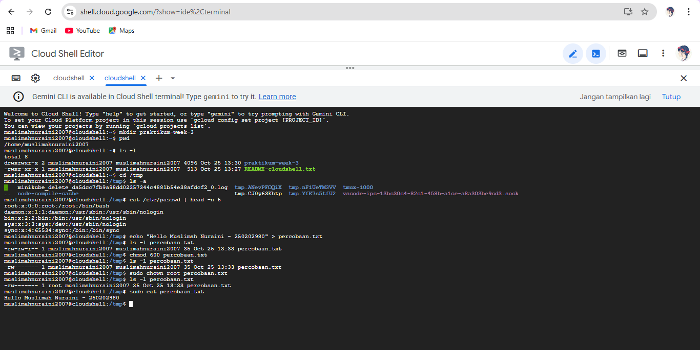

# Laporan Praktikum Minggu [3]
Topik: Manajemen File dan Permission di Linux


---

## Identitas
- **Nama**  : Muslimah Nuraini 
- **NIM**   : 250202980  
- **Kelas** : 1IKRB

---

## Tujuan
Tuliskan tujuan praktikum minggu ini.   
1. Mampu menggunakan perintah ls, pwd, cd, cat untuk navigasi file dan direktori
2. Mampu menggunakan chmod dan chown untuk manajemen hak akses file
3. Mampu menjelaskan hasil output dari perintah Linux dasar
---

## Dasar Teori
Tuliskan ringkasan teori (3–5 poin) yang mendasari percobaan.


1. Linux memakai struktur direktori bertingkat dengan root `/` sebagai pusatnya
2. Folder `/tmp` berfungsi menyimpan file sementara sistem dan user
3. File `/etc/passwd` menyimpan data akun pengguna (user, UID, GID, home, shell)
4. `chmod` mengatur izin akses file, sedangkan `chown` mengubah pemilik file
5. Pengaturan permission dan ownership penting untuk menjaga keamanan sistem

---

## Langkah Praktikum

1. Setup Environment

   - Gunakan Linux (Ubuntu/WSL).
   - Pastikan folder kerja berada di dalam direktori repositori Git praktikum: praktikum/week3-linux-fs-permission/

2. Eksperimen 1 – Navigasi Sistem File Jalankan perintah berikut:

    pwd

    ls -l

    cd /tmp

    ls -a

   - Jelaskan hasil tiap perintah.
   - Catat direktori aktif, isi folder, dan file tersembunyi (jika ada).

3. Eksperimen 2 – Membaca File Jalankan perintah:

   cat /etc/passwd | head -n 5

   Jelaskan isi file dan struktur barisnya (user, UID, GID, home, shell).

4. Eksperimen 3 – Permission & Ownership Buat file baru:

   echo "Hello <NAME><NIM>" > percobaan.txt

   ls -l percobaan.txt
      
   chmod 600 percobaan.txt

    ls -l percobaan.txt

   - Analisis perbedaan sebelum dan sesudah chmod.
   - Ubah pemilik file (jika memiliki izin sudo):

      sudo chown root percobaan.txt

       ls -l percobaan.txt

    - Catat hasilnya.

5. Eksperimen 4 – Dokumentasi

    - Ambil screenshot hasil terminal dan simpan di:

       praktikum/week3-linux-fs-permission/screenshots/

    - Tambahkan analisis hasil pada laporan.md.

6. Commit & Push

   git add .

   git commit -m "Minggu 3 - Linux File System & Permission"

   git push origin main

---

## Kode / Perintah
Tuliskan potongan kode atau perintah utama:
```bash
pwd
ls -l
cd /tmp
ls -a
cat /etc/passwd | head -n 5
echo "Hello <NAME><NIM>" > percobaan.txt
ls -l percobaan.txt
chmod 600 percobaan.txt
ls -l percobaan.txt
sudo chown root percobaan.txt
ls -l percobaan.txt
```

---

## Hasil Eksekusi
Sertakan screenshot hasil percobaan atau diagram:


---

## Analisis
- Jelaskan makna hasil percobaan.  

Percobaan ini menunjukkan bagaimana Linux mengatur dan menampilkan informasi sistem file lewat perintah seperti pwd, ls, cat, chmod, dan chown. Dari hasil tersebut terlihat bahwa setiap tindakan pengguna mulai dari melihat direktori, membaca file, hingga mengubah izin dikendalikan langsung oleh sistem agar data tetap teratur dan aman.

- Hubungkan hasil dengan teori (fungsi kernel, system call, arsitektur OS).  

Setiap perintah yang dijalankan di terminal sebenarnya memanggil system call yang diteruskan ke kernel. Kernel berperan sebagai penghubung utama antara pengguna dan perangkat keras. Melalui proses ini, sistem memastikan perintah dijalankan dengan aman dan sesuai aturan arsitektur sistem operasi.

- Apa perbedaan hasil di lingkungan OS berbeda (Linux vs Windows)?  

Di Linux, pengelolaan file dilakukan melalui struktur direktori tunggal / dengan pengaturan izin berbasis rwx untuk setiap pengguna. Sementara di Windows, sistem file menggunakan pembagian drive (C:, D:, dan seterusnya) serta pengaturan akses dilakukan melalui properti file atau ACL (Access Control List).

---

## Kesimpulan
Tuliskan 2–3 poin kesimpulan dari praktikum ini.

1. Praktikum ini membuktikan bahwa Linux mengelola file dan direktori secara terstruktur melalui perintah yang terhubung ke kernel.
2. Kernel berperan sebagai penghubung antara perintah pengguna dan perangkat keras melalui system call.
3. Linux memiliki sistem izin dan kepemilikan file yang fleksibel, sehingga keamanan dan akses data lebih terkontrol.

---

## Quiz
1. Apa fungsi dari perintah chmod?

Digunakan untuk mengubah izin akses (permission) pada file atau direktori, seperti hak membaca (read), menulis (write), dan mengeksekusi (execute) bagi pemilik, grup, maupun pengguna lain.

2. Apa arti dari kode permission rwxr-xr--?

   - rwx → pemilik file dapat membaca, menulis, dan mengeksekusi.

   - r-x → grup hanya bisa membaca dan mengeksekusi.

   - r-- → pengguna lain hanya bisa membaca.

Jadi file ini sepenuhnya bisa diakses oleh pemilik, tapi terbatas untuk grup dan pengguna lain.

3. Jelaskan perbedaan antara chown dan chmod.

   - chmod mengubah izin akses (siapa yang boleh membaca, menulis, atau menjalankan file).

   - chown mengubah kepemilikan file (siapa pemilik dan grup dari file tersebut).


---

## Refleksi Diri
Tuliskan secara singkat:
- Apa bagian yang paling menantang minggu ini?  
 Bagian yang paling menantang di minggu ini yaitu saat mencoba eksperimennya, karena ada beberapa kendala yang tidak sesuai dengan hasilnya
- Bagaimana cara Anda mengatasinya?  
   cara saya mengatasinya dengan bertanya pada teman dan meminta di ajari

---

**Credit:**  
_Template laporan praktikum Sistem Operasi (SO-202501) – Universitas Putra Bangsa_
