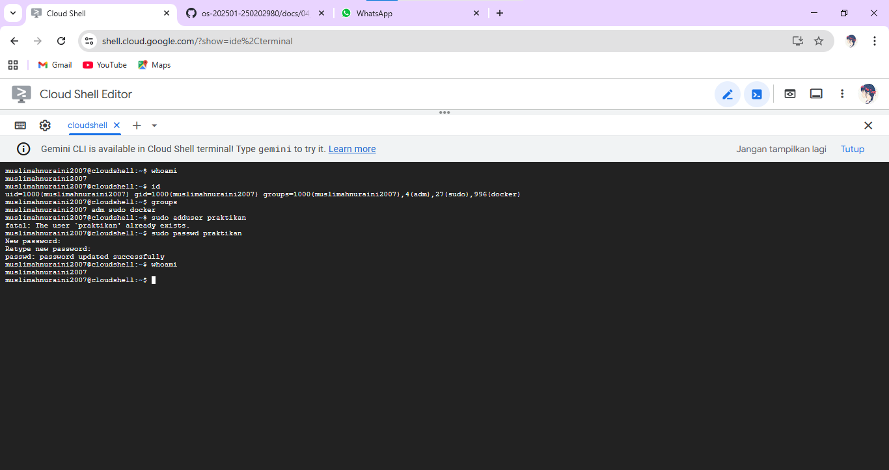
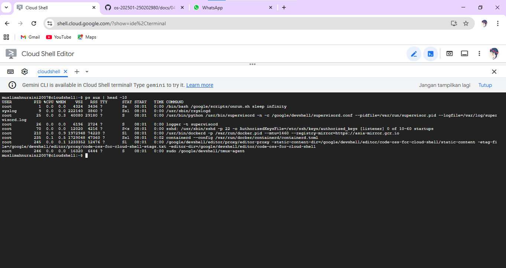
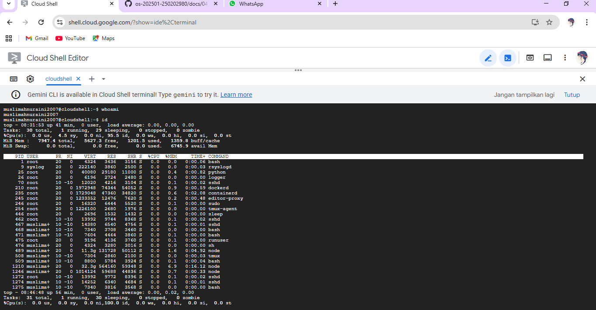
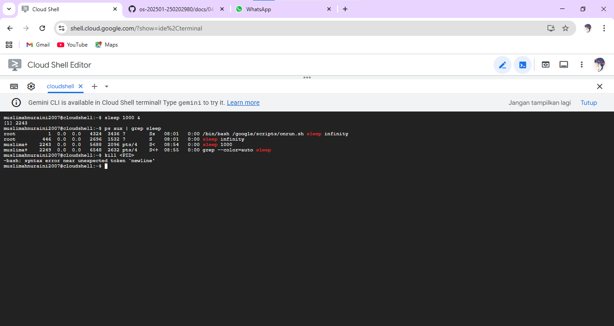
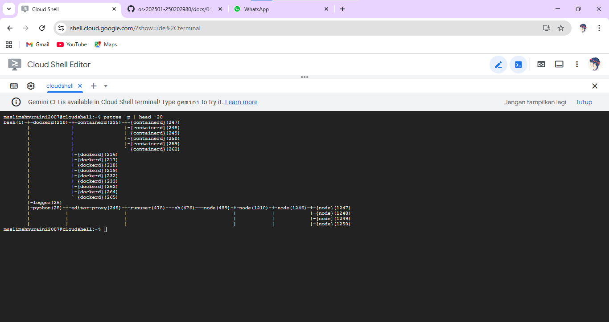

# Laporan Praktikum Minggu [4]
Topik:  Manajemen Proses dan User di Linux

---

## Identitas
- **Nama**  : Muslimah Nuraini
- **NIM**   : 250202980
- **Kelas** : 1IKRB

---

## Tujuan
Tuliskan tujuan praktikum minggu ini.   
> 
1. Mampu menjelaskan konsep proses dan user dalam sistem operasi Linux.  
2. Mampu menampilkan daftar proses yang sedang berjalan dan statusnya.  
3. Dapat menggunakan perintah untuk membuat dan mengelola user.  
4. Dapat menghentikan atau mengontrol proses tertentu menggunakan PID.  
5. Mampu menjelaskan kaitan antara manajemen user dan keamanan sistem.  


---

## Dasar Teori
Tuliskan ringkasan teori (3–5 poin) yang mendasari percobaan.

1. Manajemen pengguna dan proses dalam sistem operasi Linux.
2. Administrasi pengguna dan keamanan sistem.
3. Pengendalian proses dan manajemen sumber daya sistem.

---

## Langkah Praktikum
1. Setup Environment

   - Gunakan Linux (Ubuntu/WSL).
   - Pastikan Anda sudah login sebagai user non-root.
   - Siapkan folder kerja:
```
praktikum/week4-proses-user/
```

2. Eksperimen 1 – Identitas User Jalankan perintah berikut:
```
whoami
id
groups
```

- Jelaskan setiap output dan fungsinya.
- Buat user baru (jika memiliki izin sudo):
```
sudo adduser praktikan
sudo passwd praktikan
```
- Uji login ke user baru.

3. Eksperimen 2 – Monitoring Proses Jalankan:
```
ps aux | head -10
top -n 1
```

-  Jelaskan kolom penting seperti PID, USER, %CPU, %MEM, COMMAND.
- Simpan tangkapan layar top ke:
```
praktikum/week4-proses-user/screenshots/top.png
```
4. Eksperimen 3 – Kontrol Proses

-  Jalankan program latar belakang:
```
sleep 1000 &
ps aux | grep sleep
```

   - Catat PID proses sleep.
   - Hentikan proses:
```
kill <PID>
```
 - Pastikan proses telah berhenti dengan ps aux | grep sleep.

5. Eksperimen 4 – Analisis Hierarki Proses Jalankan:
```
pstree -p | head -20
```
- Amati hierarki proses dan identifikasi proses induk (init/systemd).
- Catat hasilnya dalam laporan.

6. Commit & Push
```
git add .
git commit -m "Minggu 4 - Manajemen Proses & User"
git push origin main
```
---

## Kode / Perintah
Tuliskan potongan kode atau perintah utama:
```bash
whoami
id
groups
ps aux | head -10
top -n 1
sleep 1000 &
ps aux | grep sleep
kill <PID>
pstree -p | head -20
```

---

## Hasil Eksekusi
Sertakan screenshot hasil percobaan atau diagram:

**Eksperimen 1**



**Eksperimen 2**


.png)

**Eksperimen 3**


**Eksperimen 4**


---

## Analisis
- Jelaskan fungsi tiap perintah.
1. Whoami : Menampilkan nama user yang sedang login saat ini.
2. id : Menampilkan informasi identitas user, seperti UID, GID, dan grup yang diikuti.
3. groups : Menampilkan daftar grup tempat user tersebut tergabung.
4. ps aux : Menampilkan semua proses yang sedang berjalan lengkap dengan informasi detail (user, PID, penggunaan CPU/memori, dll).
5. top : Menampilkan proses sistem secara real-time beserta penggunaan CPU, memori, dan performa sistem.
6. pstree : Menampilkan proses dalam bentuk hierarki pohon, menunjukkan hubungan antara proses induk dan anak.
7. adduser : Untuk menambahkan akun user baru.
8. passwd : Mengatur dan mengubah password user.
9. sleep : Menunda atau menghentikan eksekusi sementara selama waktu tertentu.
10. kill : Menghentikan proses berdasarkan PID (Process ID).
11. killall : Menghentikan semua proses yang memiliki nama program yang sama. 
- Gambarkan hierarki proses dalam bentuk diagram pohon (pstree) di laporan.

```bash 
muslimahnuraini2007@cloudshell:~$ pstree -p | head -20
bash(1)-+-dockerd(210)-+-containerd(235)-+-{containerd}(247)
        |              |                 |-{containerd}(248)
        |              |                 |-{containerd}(249)
        |              |                 |-{containerd}(250)
        |              |                 |-{containerd}(259)
        |              |                 `-{containerd}(262)
        |              |-{dockerd}(216)
        |              |-{dockerd}(217)
        |              |-{dockerd}(218)
        |              |-{dockerd}(219)
        |              |-{dockerd}(232)
        |              |-{dockerd}(233)
        |              |-{dockerd}(263)
        |              |-{dockerd}(264)
        |              `-{dockerd}(265)
        |-logger(26)
        |-python(25)-+-editor-proxy(245)-+-runuser(475)---sh(476)---node(489)-+-node(1210)-+-node(1246)-+-{node}(1247)
        |            |                   |                                    |            |            |-{node}(1248)
        |            |                   |                                    |            |            |-{node}(1249)
        |            |                   |                                    |            |            |-{node}(1250)
muslimahnuraini2007@cloudshell:~$
```

- Jelaskan hubungan antara user management dan keamanan sistem Linux.

User manajement sangat berpengaruh pada keamanan sistem linux, karena dengan membagi pengguna dengan level yang berbeda (misal,user biasa dengan administrator) sistem dapat membatasi siapa yang boleh mengakses file, menjalankan proses, atau melakukan konfigurasi sistem. Dengan cara pembagian hak akses, hanya pengguna yang berwenang yang dapat melakukan perubahan penting, sehingga dapat mencegah penyalahgunaan dan menjaga keamanan sistem.

---

## Kesimpulan
Tuliskan 2–3 poin kesimpulan dari praktikum ini.
1. Praktikum ini menunjukkan bahwa Linux menyediakan perintah untuk mengenali user, memantau proses, dan mengatur akun melalui terminal.
2. Penggunaan perintah seperti ps, top, pstree, kill, dan killall membuktikan bahwa proses dalam Linux dapat dipantau dan dikendalikan dengan detail, termasuk hubungan proses induk dan anak.
3. Manajemen user dan hak akses sangat penting untuk menjaga keamanan sistem, karena pembatasan hak akses membantu mencegah tindakan yang tidak sah dan menjaga stabilitas sistem.

---

## Quiz
1. Apa fungsi dari proses init atau systemd dalam sistem Linux?

     Fungsi dari proses init atau systemd dalam sistem Linux yaitu sebagai proses pertama yang dijalankan setelah sistem Linux menyala. Tugasnya untuk menginisialisasi sistem, menjalankan layanan penting, dan mengatur seluruh proses lain di Linux. 

2. Apa perbedaan antara kill dan killall?
  
    Perintah kill digunakan untuk menghentikan satu proses berdasarkan PID (Process ID), sedangkan killall menghentikan semua proses yang memiliki nama program yang sama.

3. Mengapa user root memiliki hak istimewa di sistem Linux?

    Karena user root adalah superuser yang memiliki akses penuh terhadap seluruh sistem Linux. Hak ini diperlukan untuk melakukan konfigurasi, instalasi, serta pengelolaan sistem secara menyeluruh, meskipun penggunaannya harus hati-hati agar tidak merusak sistem.

---

## Refleksi Diri
Tuliskan secara singkat:
- Apa bagian yang paling menantang minggu ini?  

  Bagian yang menantang diminggu ini adalah saat mengerjakakn eksperimen, karena ada terjadi error saat di eksperimen 2.

- Bagaimana cara Anda mengatasinya?

  Cara saya untuk mengatasinya adalah dengan bertanya kepada teman yang sudah bisa dan saya meminta untuk diajarkan.

---

**Credit:**  
_Template laporan praktikum Sistem Operasi (SO-202501) – Universitas Putra Bangsa_
