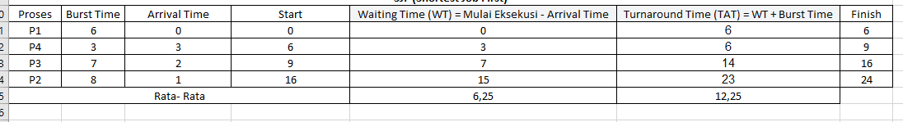

# Laporan Praktikum Minggu 5
Topik: Penjadwalan CPU – FCFS dan SJF

---

## Identitas
- **Nama**  : Muslimah Nuraini
- **NIM**   : 250202980
- **Kelas** : 1IKRB

---

## Tujuan
Tuliskan tujuan praktikum minggu ini.  
1. Bisa menghitung waktu tunggu (Waiting Time) dan waktu selesai proses (Turn Around Time) untuk algoritma FCFS dan SJF secara manual.
2.	Menyusun perhitungan penjadwalan dalam bentuk tabel yang rapi dan mudah dibaca, supaya hasilnya jelas.
3.	Membandingkan hasil kinerja antara FCFS dan SJF untuk memahami algoritma mana yang lebih efisien dalam proses penjadwalan.
4.	Berusaha memahami kelebihan dan kekurangan masing-masing, sehingga saya tahu kapan metode tersebut efektif digunakan.
5.	Mengambil kesimpulan dan membuat rekomendasi mengenai penggunaan FCFS dan SJF di situasi nyata berdasarkan hasil analisis saya.

---

## Dasar Teori
Tuliskan ringkasan teori (3–5 poin) yang mendasari percobaan.

Penjadwalan CPU memastikan proses dieksekusi secara efisien, dimana FCFS menjalankan proses sesuai urutan kedatangan tetapi dapat menyebabkan proses menunggu lama, sedangkan SJF memilih proses dengan waktu terpendek untuk mempercepat eksekusi, dengan perhitungan waktu tunggu (Start − Arrival) dan turnaround time (Waiting Time + Burst Time) untuk menilai kinerja masing-masing. 

---

## Langkah Praktikum
1. **Siapkan Data Proses**
   Gunakan tabel proses berikut sebagai contoh (boleh dimodifikasi dengan data baru):
   | Proses | Burst Time | Arrival Time |
   |:--:|:--:|:--:|
   | P1 | 6 | 0 |
   | P2 | 8 | 1 |
   | P3 | 7 | 2 |
   | P4 | 3 | 3 |

2. **Eksperimen 1 – FCFS (First Come First Served)**
   - Urutkan proses berdasarkan *Arrival Time*.  
   - Hitung nilai berikut untuk tiap proses:
     ```
     Waiting Time (WT) = waktu mulai eksekusi - Arrival Time
     Turnaround Time (TAT) = WT + Burst Time
     ```
   - Hitung rata-rata Waiting Time dan Turnaround Time.  
   - Buat Gantt Chart sederhana:  
     ```
     | P1 | P2 | P3 | P4 |
     0    6    14   21   24
     ```

3. **Eksperimen 2 – SJF (Shortest Job First)**
   - Urutkan proses berdasarkan *Burst Time* terpendek (dengan memperhatikan waktu kedatangan).  
   - Lakukan perhitungan WT dan TAT seperti langkah sebelumnya.  
   - Bandingkan hasil FCFS dan SJF pada tabel berikut:

     | Algoritma | Avg Waiting Time | Avg Turnaround Time | Kelebihan | Kekurangan |
     |------------|------------------|----------------------|------------|-------------|
     | FCFS | ... | ... | Sederhana dan mudah diterapkan | Tidak efisien untuk proses panjang |
     | SJF | ... | ... | Optimal untuk job pendek | Menyebabkan *starvation* pada job panjang |

4. **Eksperimen 3 – Visualisasi Spreadsheet (Opsional)**
   - Gunakan Excel/Google Sheets untuk membuat perhitungan otomatis:
     - Kolom: Arrival, Burst, Start, Waiting, Turnaround, Finish.
     - Gunakan formula dasar penjumlahan/subtraksi.
   - Screenshot hasil perhitungan dan simpan di:
     ```
     praktikum/week5-scheduling-fcfs-sjf/screenshots/
     ```

5. **Analisis**
   - Bandingkan hasil rata-rata WT dan TAT antara FCFS & SJF.  
   - Jelaskan kondisi kapan SJF lebih unggul dari FCFS dan sebaliknya.  
   - Tambahkan kesimpulan singkat di akhir laporan.

6. **Commit & Push**
   ```bash
   git add .
   git commit -m "Minggu 5 - CPU Scheduling FCFS & SJF"
   git push origin main

---

## Kode / Perintah
**Eksperimen 1 – FCFS (First Come First Served)**
 - Mengurutkan proses berdasarkan *Arrival Time* dan menghitung nilai untuk tiap proses
     ```
     Waiting Time (WT) = waktu mulai eksekusi - Arrival Time
     Turnaround Time (TAT) = WT + Burst Time
     ```
   - Hitung rata-rata Waiting Time dan Turnaround Time.  
   - Buat Gantt Chart sederhana:  
     ```
     | P1 | P2 | P3 | P4 |
     0    6    14   21   24
     ```

 **Eksperimen 2 – SJF (Shortest Job First)**
   - Mengurutkan proses berdasarkan *Burst Time* terpendek (dengan memperhatikan waktu kedatangan).  
   - Melakukan perhitungan WT dan TAT seperti langkah sebelumnya.  
   - Membandingkan hasil FCFS dan SJF dengan tabel berikut:

     | Algoritma | Avg Waiting Time | Avg Turnaround Time | Kelebihan | Kekurangan |
     |------------|------------------|----------------------|------------|-------------|
     | FCFS | ... | ... | Sederhana dan mudah diterapkan | Tidak efisien untuk proses panjang |
     | SJF | ... | ... | Optimal untuk job pendek | Menyebabkan *starvation* pada job panjang |


---

## Hasil Eksekusi
Sertakan screenshot hasil percobaan atau diagram:

1. Eksperimen 1 – FCFS (First Come First Served).


 - Gantt Chart :
   ```
    |  P1  |     P2     |    P3    | P4 |
   0       6            14         21   24
   ```
  - SJF lebih unggul daripada FCFS ketika waktu eksekusi proses sudah diketahui dan banyak proses berukuran kecil, karena SJF dapat meminimalkan waktu tunggu dan waktu selesai rata-rata sehingga sistem menjadi lebih efisien.

2. Eksperimen 2 – SJF (Shortest Job First)

- FCFS lebih unggul ketika burst time tidak bisa diprediksi dan sistem membutuhkan keadilan berdasarkan urutan kedatangan, karena semua diproses sesuai antrian tanpa resiko proses panjang terus tertunda.

**Perbandingan Hasil Rata-Rata WT Dan TAT Antara FCFS & SJF**
 | **Algoritma** | **Avg Waiting Time** | **Avg Turnaround Time** | **Kelebihan** | **Kekurangan** |
   |---|---|---|---|---|
   | FCFS | 8,75 |14,75| Sederhana dan mudah diterapkan | Tidak efisien untuk proses panjang |
   | SJF | 6,25 | 12,25 | Optimal untuk job pendek | Menyebabkan *starvation* pada job panjang |

---

## Analisis
Makna dari hasil percobaan ini, pemilihan algoritma penjadwalan sangat mempengaruhi kinerja sistem, di mana SJF terbukti lebih efisien dalam menurunkan waktu tunggu dan penyelesaian rata-rata dibandingkan FCFS, sedangkan FCFS tetap lebih adil karena memproses tugas berdasarkan urutan kedatangan.

---

## Kesimpulan
- Algoritma SJF memberikan kinerja yang lebih baik dibanding FCFS, dengan rata-rata waktu tunggu dan turnaround time yang lebih rendah, sehingga lebih efisien dalam mengelola proses pendek.
- FCFS lebih sederhana dan adil karena memproses berdasarkan urutan kedatangan, tetapi dapat menghasilkan waktu tunggu lebih tinggi. 
- Pemilihan algoritma penjadwalan harus disesuaikan dengan kebutuhan sistem, karena meskipun SJF lebih efisien secara rata-rata, FCFS lebih stabil dan lebih mudah diterapkan pada situasi burst time tidak diketahui.

---

## Quiz
1. Apa perbedaan utama antara FCFS dan SJF?

**Jawab :** Perbedaan utamamya yaitu dilihat cara memilih proses yang dieksekusi terlebih dahulu. FCFS menjalankan proses berdasarkan urutan kedatangan, sedangkan SJF memilih proses dengan waktu eksekusi (burst time) terpendek terlebih dahulu.

2. Mengapa SJF dapat menghasilkan rata-rata waktu tunggu minimum?

**Jawab :** SJF meminimalkan waktu tunggu karena proses yang membutuhkan waktu singkat diprioritaskan, sehingga banyak proses selesai lebih cepat dan rata-rata waktu tunggu menjadi lebih kecil.

3. Apa kelemahan SJF jika diterapkan pada sistem interaktif?

**Jawab :** Kelemahan SJF pada sistem interaktif adalah bisa menyebabkan proses panjang yang tertunda terus-menerus jika proses pendek terus datang. Selain itu, sistem interaktif sulit mengetahui burst time secara tepat, sehingga algoritma bisa salah memprediksi durasi proses.

---

## Refleksi Diri
Tuliskan secara singkat:
- Apa bagian yang paling menantang minggu ini? 
Belum dapat memahami materi sepenuhnya, karena sulit dimengerti
- Bagaimana cara Anda mengatasinya?  
Dengan bertanya pada teman yang sudah paham dan berusaha untuk memahami lagi serta mencari materi dari sumber terpercaya atau artikel-artikel.

---
**Credit:**  
_Template laporan praktikum Sistem Operasi (SO-202501) – Universitas Putra Bangsa_
