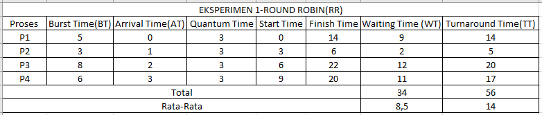

# Laporan Praktikum Minggu 6
Topik: Penjadwalan CPU – Round Robin (RR) dan Priority Scheduling
---

## Identitas
- **Nama**  : Muslimah Nuraini
- **NIM**   : 250202980
- **Kelas** : 1IKRB

---

## Tujuan
1. Menghitung waiting time dan turnaround time pada algoritma RR dan Priority.
2. Menyusun tabel hasil perhitungan dengan benar dan sistematis.
3. Membandingkan performa algoritma RR dan Priority.
4. Menjelaskan pengaruh time quantum dan prioritas terhadap keadilan eksekusi proses.
5. Menarik kesimpulan mengenai efisiensi dan keadilan kedua algoritma.

---

## Dasar Teori
Tuliskan ringkasan teori (3–5 poin) yang mendasari percobaan.

1. Round Robin (RR) adalah algoritma penjadwalan preemptive yang setiap prosesnya diberikan jatah waktu tetap (time quantum) secara bergiliran, sehingga semua proses memperoleh kesempatan eksekusi yang adil.
2. Priority Scheduling menjalankan prosesnya berdasarkan tingkat prioritasnya, yang dimana proses dengan prioritas yang lebih tinggi akan dieksekusi terlebih dahulu, baik secara preemptive maupun non-preemptive.
3. Waiting time dan turnaround time digunakan untuk mengukur efisiensi penjadwalan, sehingga perubahan nilai time quantum atau prioritas dapat mempengaruhi performa CPU.
4. Ukuran time quantum pada RR menentukan responsivitas sistem.  Quantum kecil meningkatkan pergantian proses, sedangkan quantum besar membuat RR cenderung mirip FCFS.

---

## Langkah Praktikum
1. **Siapkan Data Proses**
   Gunakan contoh data berikut (boleh dimodifikasi sesuai kebutuhan):
   | Proses | Burst Time | Arrival Time | Priority |
   |:--:|:--:|:--:|:--:|
   | P1 | 5 | 0 | 2 |
   | P2 | 3 | 1 | 1 |
   | P3 | 8 | 2 | 4 |
   | P4 | 6 | 3 | 3 |

2. **Eksperimen 1 – Round Robin (RR)**
   - Gunakan *time quantum (q)* = 3.  
   - Hitung *waiting time* dan *turnaround time* untuk tiap proses.  
   - Simulasikan eksekusi menggunakan Gantt Chart (manual atau spreadsheet).  
     ```
     | P1 | P2 | P3 | P4 | P1 | P3 | ...
     0    3    6    9   12   15   18  ...
     ```
   - Catat sisa *burst time* tiap putaran.

3. **Eksperimen 2 – Priority Scheduling (Non-Preemptive)**
   - Urutkan proses berdasarkan nilai prioritas (angka kecil = prioritas tinggi).  
   - Lakukan perhitungan manual untuk:
     ```
     WT[i] = waktu mulai eksekusi - Arrival[i]
     TAT[i] = WT[i] + Burst[i]
     ```
   - Buat tabel perbandingan hasil RR dan Priority.

4. **Eksperimen 3 – Analisis Variasi Time Quantum (Opsional)**
   - Ubah *quantum* menjadi 2 dan 5.  
   - Amati perubahan nilai rata-rata *waiting time* dan *turnaround time*.  
   - Buat tabel perbandingan efek *quantum*.

5. **Eksperimen 4 – Dokumentasi**
   - Simpan semua hasil tabel dan screenshot ke:
     ```
     praktikum/week6-scheduling-rr-priority/screenshots/
     ```
   - Buat tabel perbandingan seperti berikut:

     | Algoritma | Avg Waiting Time | Avg Turnaround Time | Kelebihan | Kekurangan |
     |------------|------------------|----------------------|------------|-------------|
     | RR | ... | ... | Adil terhadap semua proses | Tidak efisien jika quantum tidak tepat |
     | Priority | ... | ... | Efisien untuk proses penting | Potensi *starvation* pada prioritas rendah |

6. **Commit & Push**
   ```bash
   git add .
   git commit -m "Minggu 6 - CPU Scheduling RR & Priority"
   git push origin main

---

## Kode / Perintah
```bash
 WT[i] = waktu mulai eksekusi - Arrival[i]
 TAT[i] = WT[i] + Burst[i]
 Average Waiting Time (WT) = Total WT / Jumlah Proses
 Average Turnaround Time (TAT) = Total TAT / Jumlah Proses
```

---

## Hasil Eksekusi
Sertakan screenshot hasil percobaan atau diagram:
1. Eksperimen 1-Round Robin

- Sisa Burst Time Tiap Putaran:

| Proses |Burts Time Awal| Putaran 1 | Putaran 2 | Putaran 3 |
|--------|--------|-----------|-----------|-----------|
| P1     |  5  |   2     |    0      |     -     |
| P2     |  3  |   0     |    -      |     -     |
| P3     |  8  |   5     |    2      |     0     |
| P4     |  6  |   3     |    0      |     -     |

Simulasikan eksekusi menggunakan `Gantt Chart`:
```
    | P1 | P2 | P3 | P4 | P1 | P3 | P4 | P3 |
    0    3    6    9   12   14   17   20   22
```
2. Eksperimen 2-Priority Scheduling
.png)
Simulasikan eksekusi menggunakan `Gantt Chart`:
```bash
     | P1 | P2 | P4 | P3 |
     0    5    8   14   22 
```

3. Eksperimen 3 Analisis Variasi Time Quantum (Opsional)
- Quantum 2

| Proses | Finish | Arrival Time | Burst Time | Turnaround Time (TAT) | Waiting Time (WT) |
|:------:|:------:|:-------------:|:-----------:|:-----------------------:|:------------------:|
| P1 | 14 | 0 | 5 | 14 | 9 |
| P2 | 11 | 1 | 3 | 10 | 7 |
| P3 | 22 | 2 | 8 | 20 | 12 |
| P4 | 20 | 3 | 6 | 17 | 11 |


- Rata Rata WT = 9.75
- Rata Rata TAT = 15.25

Gantt Chart

```
  | P1 | P2 | P3 | P1 | P4 | P2 | P3 | P1 | P4 | P3 | P4 | P3 |
  0    2    4    6    8    10   11   13   14   16  18   20   22
```
- Quantum 5

| Proses | Arrival Time | Burst Time | Finish Time | Turnaround (TAT) | Waiting (WT) |
|--------|---------|-------|----------|------------|-----------|
| P1     |    0    |   5   |     5      |     5     |    0  |
| P2     |    1    |   3   |     8      |     7     |    4  |
| P3     |    2    |   8   |    21      |    19     |   11  |
| P4     |    3    |   6   |    22      |    19     |   13  |
- Rata Rata WT = 7.00
- Rata Rata TAT = 12.50
Gantt Chart
```
     | P1 | P2 | P3 | P4 | P3 | P4 | 
     0    5    8    13   18   21   22
```
- Tabel Perbandingan Efek Quantum

| Quantum | Rata-rata Waiting Time (WT) | Rata-rata Turnaround Time (TAT) | Analisis Pengaruh |
|---------|------------------------------|----------------------------------|--------------------|
| 2       |         9.75              |      15.25            | Sangat adil karena frekuensi pergantian konteks yang sangat tinggi, namun hal ini menyebabkan peningkatan beban overhead pada CPU. |
| 3       |         8.50              |      14.00            | Masih memberikan keadilan yang baik, tetapi dengan penggunaan sumber daya yang lebih optimal dan efisien.|
| 5       |         7.00              |      12.50            | Frekuensi pergantian konteks menurun sehingga lebih efisien untuk proses dengan waktu eksekusi panjang, meskipun keadilan bagi proses pendek bisa berkurang.
 |

4. Eksperimen 4 Tabel Perbandingan

| Algoritma | Avg Waiting Time | Avg Turnaround Time | Kelebihan | Kekurangan |
|------------|------------------|----------------------|------------|-------------|
| RR | 8,5 | 14 | Adil terhadap semua proses | Tidak efisien jika quantum tidak tepat |
| Priority | 5,25 | 10,75 | Efisien untuk proses penting | Potensi *starvation* pada prioritas rendah |
---

## Analisis
1. Priority Scheduling menghasilkan rata-rata WT = 5,25, lebih kecil dibandingkan Round Robin (8,5). Yang artinya, pada proses ini lebih sedikit menunggu ketika dijadwalkan berdasarkan prioritasnya.
2. Priority Scheduling juga memberikan rata-rata TT = 10,75, lebih baik dibanding Round Robin (14). Hal ini menunjukkan bahwa penyelesaian dengan proses secara keseluruhan lebih cepat ketika prioritas digunakan.
3. Round Robin menyebabkan proses berjalan lebih lambat karena pembagian time quantum membuat proses harus antre beberapa kali, sehingga TT dan WT meningkat akibat seringnya context switching.

---

## Kesimpulan
1. Priority Scheduling lebih efisien karena menghasilkan WT dan TT yang lebih rendah dibandingkan Round Robin.
2. Round Robin lebih adil, tetapi performanya menurun jika pemilihan time quantumnya tidak tepat.
3. Time quantum memengaruhi efisiensi,yang di mana semakin kecil quantum, maka semakin besar overhead, semakin besar quantum, maka semakin cepat pula proses selesainya.


---

## Quiz
1. Apa perbedaan utama antara Round Robin dan Priority Scheduling?  

   **Jawab:** Round Robin menjalankan proses secara bergantian dengan jatah waktu yang sama, sedangkan Priority Scheduling menjalankan proses berdasarkan tingkat prioritas sehingga proses dengan prioritas yang lebih tinggi selalu didahulukan.

2. Apa pengaruh besar/kecilnya *time quantum* terhadap performa sistem?  

   **Jawab :** Time quantum yang terlalu kecil membuat sistem banyak melakukan context switching (perpindahan CPU antar proses yang membutuhkan waktu untuk menyimpan dan memuat status) sehingga menjadi kurang efisien, sedangkan quantum yang terlalu besar membuat responsivitas menurun dan algoritma menjadi mirip FCFS.


3. Mengapa algoritma Priority dapat menyebabkan *starvation*?   
    **Jawab :** Karena proses dengan prioritas yang rendah bisa tertunda terus jika selalu ada proses prioritas tinggi yang datang, maka proses dengan prioritas rendah dapat menunggu sangat lama atau bahkan tidak sempat dijalankan.

---

## Refleksi Diri
Tuliskan secara singkat:
- Apa bagian yang paling menantang minggu ini?  

Susahnya memahami materi walau sudah dijelaskan 

- Bagaimana cara Anda mengatasinya?  

Cara mengatasinya dengan memahami materinya lebih lanjut dan bertanya pada teman

---

**Credit:**  
_Template laporan praktikum Sistem Operasi (SO-202501) – Universitas Putra Bangsa_
