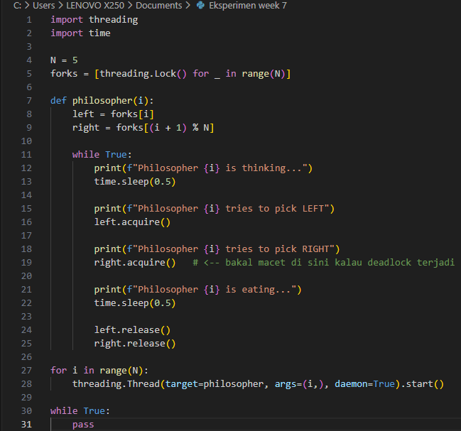
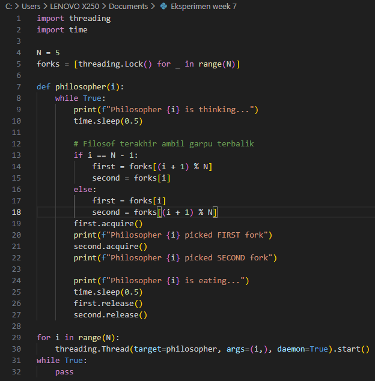

# Laporan Praktikum Minggu 7
Topik: Sinkronisasi Proses dan Masalah Deadlock
---

## Identitas
- **Nama**  :
1. Muslimah Nuraini (250202980)
2. Alya Deviana Putri Reynaldi (250202928)
3. lutfi khoerunnisa (250202947)
4. Aster Rifani (250202915)
- **Kelas** : 1IKRB

---

## Pendahuluan 
Masalah Dining Philosophers merupakan model klasik dalam ilmu sistem operasi yang mengilustrasikan risiko deadlock pada proses konkurensi. Dalam skenario ini, lima filosof berbagi lima garpu, di mana setiap filosof memerlukan dua garpu untuk melakukan aktivitas makan. Tanpa adanya mekanisme pencegahan, kondisi deadlock dapat muncul ketika semua filosof menahan satu garpu dan menunggu garpu lainnya yang dipegang oleh filosof tetangga, sehingga terbentuk siklus tunggu.

---

## Dasar Teori
- Deadlock

   Terjadinya dua atau lebih proses saling menunggu sumber daya yang tidak akan pernah terjadi karena saling mengunci. Ada empat kondisi yang menyebabkan deadlock,yaitu:  
    1. Mutual Exclusion
    2. Hold and Wait
    3. No Preemption
    4. Circular Wait
- Critical section

   Bagian dari kode yang dimana proses mengakses data bersama.
- Mutual exclusion (Mutex)

   Memastikan hanya satu proses yang dapat berada di critical section dalam satu waktu.
- Teknik Sinkronisasi
   1. Mutex
      - Hanya satu proses yang boleh memegang lock pada satu waktu.
      - Cocok untuk melindungi resource tunggal.
      - Jika lock diambil proses lain harus menunggu.
   2. Semaphore
      - Variabel sinkronisasi yang dapat bernilai lebih dari 1.
      - Operasi dasar : wait (P) dan signal (V)
      - Digunakan untuk mengelola akses ke sejumlah sumber daya tertentu atau mengatur antrian proses.
- Dining Philosophers problem

   Permasalahan yang diperkenalkan untuk menggambarkan masalah sinkronisasi dalam berbagi sumber daya terbatas.
   Konsep Dasar:
   - Terdapat N filsuf yang duduk mengelilingi meja.
   - Di antara setiap dua filsuf terdapat satu garpu.
   - Untuk makan, setiap filsuf membutuhkan dua garpu.
   - Jika semua filsuf mengambil satu garpu dan menunggu garpu kedua, deadlock dapat terjadi.

---
## Metode
- **Eksperimen 1 – Simulasi Dining Philosophers (Deadlock Version)**

   Pada eksperimen ini simulasi dasar Dining Philosophers di mana setiap proses mengambil garpu kiri lalu garpu kanan tanpa mekanisme pencegah deadlock. Tujuannya adalah mengamati kapan deadlock terjadi, yaitu saat semua Philosopher memegang satu garpu dan menunggu garpu lainnya secara bersamaan.
- **Eksperimen 2 – Versi Fixed (Menggunakan Semaphore)**

   Pada eksperimen ini ditambahkan mekanisme sinkronisasi berupa **semaphore dengan nilai N−1** untuk membatasi hanya maksimal empat Philosopher yang dapat memasuki area makan. Pembatasan ini mencegah semua garpu diambil bersamaan sehingga memutus terjadinya circular wait dan menghilangkan deadlock.
- **Eksperimen 3 – Analisis Deadlock**

   Menganalisis empat kondisi penyebab deadlock pada versi pertama serta menjelaskan bagaimana versi fixed memecah tiap kondisi. Hasil analisis disajikan dalam tabel yang membandingkan kondisi deadlock pada kedua versi.

---

## Langkah Praktikum
1. **Persiapan Tim**
   - Bentuk kelompok beranggotakan 3–4 orang.  
   - Tentukan ketua dan pembagian tugas (analisis, implementasi, dokumentasi).

2. **Eksperimen 1 – Simulasi Dining Philosophers (Deadlock Version)**
   - Implementasikan versi sederhana dari masalah *Dining Philosophers* tanpa mekanisme pencegahan deadlock.  
   - Contoh pseudocode:
     ```text
     while true:
       think()
       pick_left_fork()
       pick_right_fork()
       eat()
       put_left_fork()
       put_right_fork()
     ```
   - Jalankan simulasi atau analisis alur (boleh menggunakan pseudocode atau diagram alur).  
   - Identifikasi kapan dan mengapa deadlock terjadi.

3. **Eksperimen 2 – Versi Fixed (Menggunakan Semaphore / Monitor)**
   - Modifikasi pseudocode agar deadlock tidak terjadi, misalnya:
     - Menggunakan *semaphore (mutex)* untuk mengontrol akses.
     - Membatasi jumlah filosof yang dapat makan bersamaan (max 4).  
     - Mengatur urutan pengambilan garpu (misal, filosof terakhir mengambil secara terbalik).  
   - Analisis hasil modifikasi dan buktikan bahwa deadlock telah dihindari.

4. **Eksperimen 3 – Analisis Deadlock**
   - Jelaskan empat kondisi deadlock dari versi pertama dan bagaimana kondisi tersebut dipecahkan pada versi fixed.  
   - Sajikan hasil analisis dalam tabel seperti contoh berikut:

     | Kondisi Deadlock | Terjadi di Versi Deadlock | Solusi di Versi Fixed |
     |------------------|---------------------------|------------------------|
     | Mutual Exclusion | Ya (satu garpu hanya satu proses) | Gunakan semaphore untuk kontrol akses |
     | Hold and Wait | Ya | Hindari proses menahan lebih dari satu sumber daya |
     | No Preemption | Ya | Tidak ada mekanisme pelepasan paksa |
     | Circular Wait | Ya | Ubah urutan pengambilan sumber daya |

5. **Eksperimen 4 – Dokumentasi**
   - Simpan semua diagram, screenshot simulasi, dan hasil diskusi di:
     ```
     praktikum/week7-concurrency-deadlock/screenshots/
     ```
   - Tuliskan laporan kelompok di `laporan.md` (format IMRaD singkat: *Pendahuluan, Metode, Hasil, Analisis, Diskusi*).

6. **Commit & Push**
   ```bash
   git add .
   git commit -m "Minggu 7 - Sinkronisasi Proses & Deadlock"
   git push origin main
   ```

---

## Kode / Perintah
```text
     while true:
       think()
       pick_left_fork()
       pick_right_fork()
       eat()
       put_left_fork()
       put_right_fork()
     
```

---

## Hasil Eksekusi
**Eksperimen 1 - Simulasi Dining Philosophers (Deadlock Version)**

**Eksperimen 2 - Versi Fixed (Menggunakan Semaphore / Monitor)**


---

## Analisis
1. **Eksperimen 1 – Simulasi Dining Philosophers (Deadlock Version)**

Deadlock pada kode Dining Philosophers terjadi ketika semua philosopher secara bersamaan berhasil mengambil garpu kiri, lalu masing-masing mencoba mengambil garpu kanan yang ternyata sedang dipegang oleh philosopher di sebelahnya, sehingga setiap thread memegang satu garpu dan menunggu garpu lainnya tanpa ada satu pun yang bisa melanjutkan; kondisi ini memenuhi pola circular wait, sehingga tidak ada garpu yang dilepas dan seluruh proses berhenti di pemanggilan `right.acquire()`.
2. **Eksperimen 2 – Versi Fixed (Menggunakan Semaphore / Monitor)**

 Strategi penanganan Deadlock yang paling efektif adalah dengan membatasi jumlah proses yang dapat bersaing untuk sumber daya (N-1), seperti membatasi 4 filosof untuk 5 garpu. Modifikasi ini secara langsung melanggar kondisi Tunggu Melingkar (Circular Wait) dan Tahan dan Tunggu (Hold and Wait), sehingga sistem dijamin tidak akan pernah masuk ke dalam kondisi kebuntuan permanen (Deadlock).
3. **Eksperimen 3 – Analisis Deadlock**
   | Kondisi Deadlock | Terjadi di Versi Deadlock | Solusi di Versi Fixed |
     |------------------|---------------------------|------------------------|
     | Mutual Exclusion | Ya | Dipertahankan,(Ini dibutuhkan untuk integritas data) Dicegah menggunakan Lock/Semaphore |
     | Hold and Wait | Ya |Dihindari,dengan memastikan proses harus mengambil semua sumber daya yang diperlukan secara simultan atau melepaskannya jika gagal mendapatkan yang kedua |
     | No Preemption | Ya | Dihindari,dengan mengizinkan pelepasan paksa sumber daya yang ditahan, atau dengan melepaskan secara sukarela sumber daya yang ditahan jika permintaan sumber daya tambahan gagal |
     | Circular Wait | Ya | Dihindari,dengan mengubah urutan pengambilan sumber daya misalnya, membuat satu filosof mengambil garpu dengan urutan terbalik, atau menggunakan urutan pengindeksan global |

---
## Diskusi

Dari hasil percobaan, dapat diketahui bahwa versi pertama program mengalami deadlock karena setiap filosof saling menunggu garpu yang tidak pernah dilepas. Setelah diterapkan mekanisme pencegahan (semaphore/aturan pengambilan garpu), program dapat berjalan tanpa kebuntuan. Hal ini menunjukkan bahwa sinkronisasi sangat penting untuk memastikan proses dapat berjalan bersamaan tanpa saling menghambat, serta membuktikan bahwa pengaturan akses sumber daya mampu mencegah deadlock secara efektif.

---

## Kesimpulan
1. Analisis Kode Awal (Deadlock Terjadi): Kode Filosof Makan awal membuktikan bahwa jika semua empat kondisi Deadlock (Mutual Exclusion, Hold and Wait, No Preemption, dan Circular Wait) terpenuhi secara simultan, Deadlock pasti terjadi, mengakibatkan sistem macet permanen (Starvation).
2. Sinkronisasi Proses menekankan bahwa Mutual Exclusion (Saling Pengecualian) adalah syarat fundamental untuk menjaga integritas data dan mencegah Race Condition di Critical Section. Namun, meskipun Mutual Exclusion diterapkan, kegagalan dalam manajemen sumber daya tetap dapat terjadi.
3. Solusi untuk Deadlock terletak pada pelanggaran salah satu dari empat kondisi pembentuknya. Analisis modifikasi kode, seperti membatasi jumlah proses menjadi N-1 (misalnya, 4 filosof untuk 5 garpu), secara efektif menghindari kebuntuan permanen. Strategi ini berhasil karena memutus rantai tunggu melingkar dan menjamin bahwa selalu ada jalan keluar (safe state), sehingga semua proses pada akhirnya dapat maju.

---

## Quiz
1. Sebutkan empat kondisi utama penyebab deadlock.
- Mutual Exclusion 
- Hold and Wait 
- No Preemption 
- Circular Wait
2. Mengapa sinkronisasi diperlukan dalam sistem operasi?
    
    Sinkronisasi sangat diperlukan dalam sistem operasi karena banyak proses yang dapat berjalan secara bersamaan dan mengakses resource yang sama, sehingga tanpa adanya pengaturan yang tepat dapat terjadi race condition, inkonsistensi data, dan gangguan pada stabilitas sistem. Dengan sinkronisasi, akses ke resource menjadi teratur, data tetap konsisten, dan eksekusi proses berlangsung aman serta dapat diprediksi.

3. Jelaskan perbedaan antara semaphore dan monitor.

   Semaphore adalah mekanisme sinkronisasi tingkat rendah yang menggunakan penghitung serta operasi `wait` dan `signal` untuk mengatur akses ke resource, sedangkan monitor merupakan mekanisme tingkat tinggi yang menggabungkan data, prosedur, serta aturan sinkronisasi dalam satu struktur sehingga hanya satu thread dapat masuk pada satu waktu, akibatnya semaphore lebih fleksibel tetapi rawan kesalahan, sementara monitor lebih aman dan terstruktur karena pengaturan akses sudah terintegrasi di dalamnya.

---

## Refleksi Diri
Tuliskan secara singkat:
- Apa bagian yang paling menantang minggu ini?

  Susahnya mencari waktu untuk mengerjakan bersama secara tatap muka
- Bagaimana cara Anda mengatasinya?

   Berdiskusi secara online (WhastApp)

---

**Credit:**  
_Template laporan praktikum Sistem Operasi (SO-202501) – Universitas Putra Bangsa_
