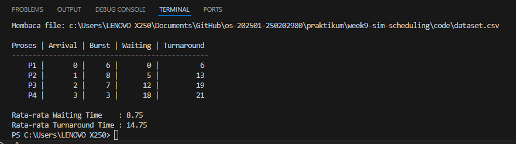

# Laporan Praktikum Minggu 9
Topik: Simulasi Algoritma Penjadwalan CPU

---

## Identitas
- **Nama**  : Muslimah Nuraini
- **NIM**   : 250202980
- **Kelas** : 1IKRB

---

## Tujuan
Tuliskan tujuan praktikum minggu ini.  
1. Membuat program simulasi algoritma penjadwalan FCFS dan/atau SJF.
2. Menjalankan program dengan dataset uji yang diberikan atau dibuat sendiri.
3. Menyajikan output simulasi dalam bentuk tabel atau grafik.
4. Menjelaskan hasil simulasi secara tertulis.
5. Mengunggah kode dan laporan ke Git repository dengan rapi dan tepat waktu.

---

## Dasar Teori
1. Simulasi penjadwalan CPU adalah proses pemodelan mekanisme kerja CPU dalam mengatur urutan eksekusi proses menggunakan bantuan program algoritma. Melalui simulasi,alur eksekusi proses dapat diamati tanpa harus dijalankan langsung pada sistem operasi.
2. FCFS dan SJF
- FCFS menjalankan suatu proses berdasarkan dengan urutan kedatangan
- SJF menjalankan proses dengan waktu eksekusi yang paling singkat terlebih dahulu
3. Simulasi ini digunakan untuk mengevaluasi kinerja algoritma penjadwalan CPU dengan menghitung parameter seperti waiting time dan turnaround time tanpa harus melakukan perhitungan manual secara berulang
4. Dengan adanya simulasi, proses analisis algoritma penjadwalan menjadi lebih objektif,mengurangi kemungkinan kesalahan perhitungan manual, serta mempermudah pengujian pada jumlah proses yang lebih banyak.


---

## Langkah Praktikum
1. **Menyiapkan Dataset**

   Buat dataset proses minimal berisi:

   | Proses | Arrival Time | Burst Time |
   |:--:|:--:|:--:|
   | P1 | 0 | 6 |
   | P2 | 1 | 8 |
   | P3 | 2 | 7 |
   | P4 | 3 | 3 |

2. **Implementasi Algoritma**

   Program harus:
   - Menghitung *waiting time* dan *turnaround time*.  
   - Mendukung minimal **1 algoritma (FCFS atau SJF non-preemptive)**.  
   - Menampilkan hasil dalam tabel.

3. **Eksekusi & Validasi**

   - Jalankan program menggunakan dataset uji.  
   - Pastikan hasil sesuai dengan perhitungan manual minggu sebelumnya.  
   - Simpan hasil eksekusi (screenshot).

4. **Analisis**

   - Jelaskan alur program.  
   - Bandingkan hasil simulasi dengan perhitungan manual.  
   - Jelaskan kelebihan dan keterbatasan simulasi.

5. **Commit & Push**

   ```bash
   git add .
   git commit -m "Minggu 9 - Simulasi Scheduling CPU"
   git push origin main
   ```
---

## Kode / Perintah
```
praktikum/week9-sim-scheduling/
├─ code/
│  ├─ scheduling_simulation.*
│  └─ dataset.csv
├─ screenshots/
│  └─ hasil_simulasi.png
└─ laporan.md
```


---

## Hasil Eksekusi


---

## Analisis
- Alur Program

  Program membaca data proses dari file CSV, kemudian mengurutkan proses berdasarkan waktu kedatangan. Lalu CPU mengeksekusi setiap proses satu per satu sesuai urutan, sambil menghitung waiting time dan turnaround time untuk masing-masing proses. Setelah semua proses selesai, hasil perhitungan beserta nilai rata-ratanya ditampilkan.

- Perbandingan hasil simulasi di atas dengan hasil perhitungan manual
    1. Hasil dari simulasi FCFS menunjukkan waiting time dan turnaround time yang sama dengan perhitungan manual. 
    2. Keduanya tetap menggunakan urutan proses berdasarkan arrival time dan rumus yang sama, sehingga hasilnya konsisten. 
    3. Hanya saja, diperhitungan manual lebih memakan waktu dan rawan kesalahan, sementara dengan menggunakan algoritma seperti disimulasi di atas akan lebih cepat dan akurat.

- Kelebihan dan Kekurangan
   1. Kelebihan
      - Mempermudah perhitungan waiting time dan turnaround time secara otomatis
      - Mengurangi risiko kesalahan perhitungan 
      - Dapat menangani banyak proses dengan cepat
      - Hasil simulasi konsisten dan mudah dianalisis
   2. Kekurangan
      - Hanya mensimulasikan algoritma FCFS, belum mendukung algoritma lain seperti SJF atau Priority
      - Tidak memperhitungkan preemption (proses tidak bisa dipotong)
      - Kurang efisien jika terdapat proses dengan burst time sangat besar (convoy effect)

---

## Kesimpulan
1. Algoritma FCFS mengeksekusi proses sesuai urutan kedatangan, sehingga proses yang datang lebih awal akan diproses lebih dulu.
2. Dengan simulasi menggunakan program algoritma memberikan hasil yang sama dengan perhitungan manual, tetapi lebih cepat dan mengurangi resiko kesalahan.
3. Kelebihan dari FCFS yaitu sederhana dan mudah diterapkan, namun memiliki keterbatasan seperti kurang efisien jika ada proses dengan burst time panjang (convoy effect).
---

## Quiz
1. Mengapa simulasi diperlukan untuk menguji algoritma scheduling?  
  Simulasi diperlukan untuk menguji algoritma scheduling karena memungkinkan penghitungan waiting time, turnaround time, dan urutan eksekusi proses secara otomatis dan cepat. Dengan simulasi ini, kita dapat mengevaluasi kinerja algoritma tanpa melakukan perhitungan manual yang memakan waktu dan menghindari banyaknya kesalahan, terutama jika jumlah proses banyak.

2. Apa perbedaan hasil simulasi dengan perhitungan manual jika dataset besar?  
   Perbedaan hasil simulasi dengan perhitungan manual jika dataset besar, jika menggunakan seperti hasil simulasi di atas maka akan lebih efisien dan konsisten, sedangkan dalam perhitungan manual cenderung lebih lambat dan rentan kesalahan.

3. Algoritma mana yang lebih mudah diimplementasikan? Jelaskan.
  Algoritma yang lebih mudah diimplementasikan yaitu algoritma FCFS (First Come First Served) karena sederhana, hanya mengurutkan proses berdasarkan waktu kedatangan dan mengeksekusinya satu per satu. Tidak memerlukan perhitungan prioritas atau pemotongan proses, sehingga cocok untuk praktik dan pemahaman dasar scheduling.

---

## Refleksi Diri
Tuliskan secara singkat:

- Apa bagian yang paling menantang minggu ini?  
  Yang paling menantang minggu ini jelas saat mencoba untuk menjalankan program,karena butuh ketelitian untuk membuatnya juga.
- Bagaimana cara Anda mengatasinya?  
   Cara saya mengatasinya dengan meneliti kembali dimana letak kesalahannya.

---

**Credit:**  
_Template laporan praktikum Sistem Operasi (SO-202501) – Universitas Putra Bangsa_
